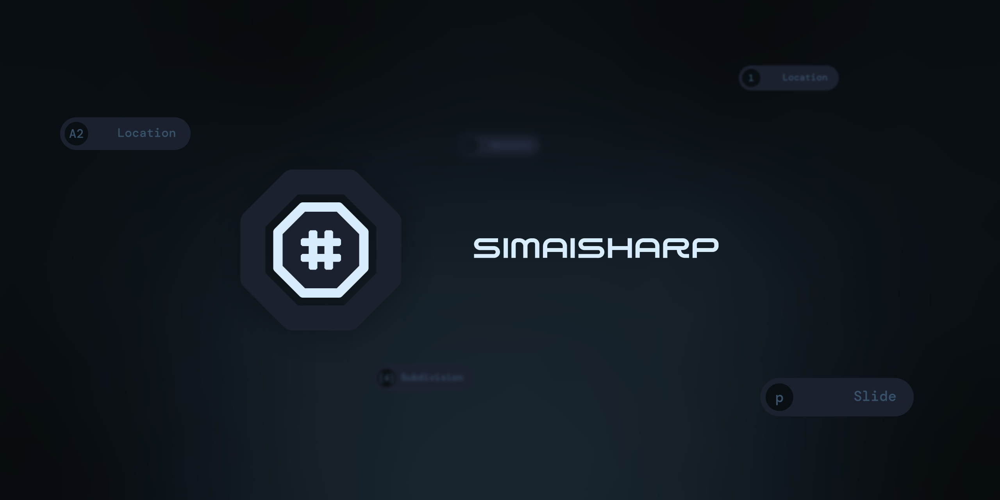

# SimaiSharp

SimaiSharp is an interpreter and serializer for [simai](https://w.atwiki.jp/simai/), 
a custom chart format for the arcade rhythm game [maimai](https://maimai.sega.jp/),
written in [C#](https://learn.microsoft.com/en-us/dotnet/csharp/), 
originally intended for use in [AstroDX](https://github.com/2394425147/maipaddx).

# Getting Started

To use SimaiSharp in your own project, 
you will need to add a reference to the SimaiSharp library in your solution.

Then, use the following method to deserialize a chart:

```csharp
// Specify the chart file
var filePath = @"Z:\path\to\your\chart.txt";

// Read it into your program
var simaiFile = new SimaiFile(filePath);

// Specify a key to read, without the "&"
var chartKey = @"inote_5";

// Get the corresponding value as a string
var rawChart = simaiFile.GetValue(chartKey);

// Deserialize the chart
var chart = SimaiConvert.Deserialize(rawChart);
```

# Contribute

Issues and pull requests are welcome!